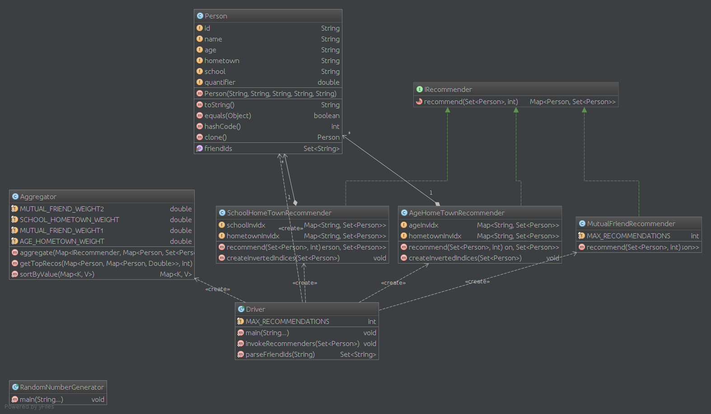

<b>Problem: Design a friend recommendation system in a facebook­like social network </b>
 
<b>Solution: </b>

 

Description: 
The system contains a Recommender interface that all recommenders implement. Currently three different 
recommenders are available : 

● AgeHomeTownRecommender ­ recommends people with same age and hometown 
● SchoolHomeTownRecommnder ­ recommends people with same school and hometown 
● MutualFriendRecommender ­ recommends a randomly chosen friend from the friend lists of people with 
whom the user shares highest number of mutual friends 
 
Results from each of these recommenders is aggregated by the Aggregator. It assigns weights to the 
recommendations and returns top 5 recommendations for each user. 
 
A random generator is employed to create artificial lists of people. 